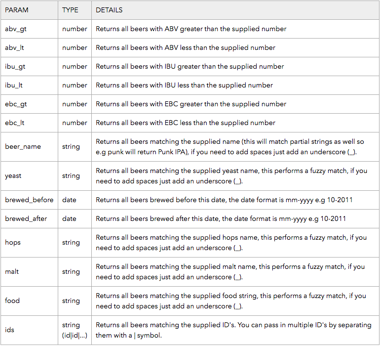

# Punk API Web Service

A Service Object Model for Punk API. Including test framework.

### Technology used

The API Service was built using Ruby, with the following gems:

* httparty
* json
* rpsec

### Installation

To run the program locally, simply clone/download the git repository.

Ensure that the gems 'json' and 'rspec' are installed in your machine.

### Using the product

In the termnial change directory to **api_project**

Open punk_object.rb in a text editor.

To contact the API, you must create an instance of the BeerService class and use the appropriate function on the instance.

#### Find a beer with a known id

To get information for a specific beer with a known id, in the punk_object.rb file underneath the class add the following code:

```
beer = BeersService.new
p beer.get_single_beer("id")

```
Then in the terminal run the file with: **ruby punk_object.rb**

#### Find a random beer

To get information for a random beer, in the punk_object.rb file underneath the class add the following code:

```
beer = BeersService.new
p beer.get_random_beer

```
Then in the terminal run the file with: **ruby punk_object.rb**

#### Get all beers

To get information for all beers, in the punk_object.rb file underneath the class add the following code:

```
beer = BeersService.new
p beer.get_all_beers

```

#### Search beers

To search for information on beers which meet certain search criteria, in the punk_object.rb file underneath the class add the following code:

```
beer = BeersService.new
p beer.get_beer_search_results({search_criteria})

```

Where *{search_criteria}* is a hash containing the following possible key-value pairs:



e.g. To search for beers with an abv greater than 8, with American yeast, you would use:
```p beer.get_beer_search_results({'abv_gt' => '8', 'yeast' => 'American'})```
